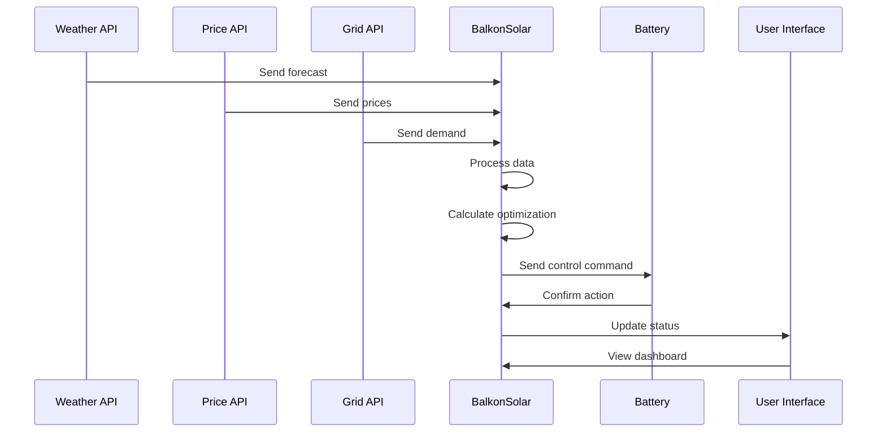

# BalkonSolar Solution Overview

# [2024-05-10] Virtual Battery & AppDaemon System Updates

- Modular virtual battery system with controller, supporting activation/deactivation and external charge setting.
- Absolute imports used for all AppDaemon apps (e.g., `from virtual_battery import VirtualBattery`).
- Sensor readers (`household_consumption_reader.py`, `pv_production_reader.py`) handle 'unavailable' or non-numeric values gracefully, defaulting to 0.0 W and logging a warning.
- Both readers log their current value every minute, even if unchanged.
- Battery controller auto-turns off and logs when fully charged/discharged; can be set externally via `set_battery_charge()`.
- Debugging: Added logs to `initialize()`, checked app names in `apps.yaml`, and handled app availability.
- Noted that Home Assistant connection errors are unrelated to app logic and are usually transient.

---

+Note: For detailed user goals, data requirements, and logic assumptions, see the MVP section in productContext.md.

## System Workflow

### 1. Data Collection and Analysis
```
┌─────────────┐     ┌─────────────┐     ┌─────────────┐
│  Weather    │     │ Electricity │     │   Grid      │
│   Data      │────►│   Prices    │────►│   Demand    │
└─────────────┘     └─────────────┘     └─────────────┘
         │                 │                   │
         ▼                 ▼                   ▼
┌─────────────────────────────────────────────────────┐
│              Data Integration Layer                 │
└─────────────────────────────────────────────────────┘
                           │
                           ▼
┌─────────────────────────────────────────────────────┐
│              Optimization Engine                    │
└─────────────────────────────────────────────────────┘
                           │
                           ▼
┌─────────────┐     ┌─────────────┐     ┌─────────────┐
│   Battery   │     │   Inverter  │     │  Smart Plug │
│  Control    │◄────┤   Control   │◄────┤   Control   │
└─────────────┘     └─────────────┘     └─────────────┘
```

### 2. Core Components Interaction

#### A. Data Collection
1. **Weather Data**
   - Solar radiation forecasts
   - Cloud cover predictions
   - Temperature data
   - Update frequency: Every 15 minutes

2. **Electricity Prices**
   - Real-time market prices
   - Day-ahead prices
   - Historical price data
   - Update frequency: Every 5 minutes

3. **Grid Demand**
   - Current grid load
   - Demand forecasts
   - Grid stability metrics
   - Update frequency: Every 5 minutes

#### B. Optimization Process
1. **Data Processing**
   - Normalize incoming data
   - Validate data quality
   - Store historical data
   - Generate predictions

2. **Decision Making**
   - Calculate optimal charging/discharging times
   - Determine power flow direction
   - Estimate cost savings
   - Predict CO₂ impact

3. **Action Execution**
   - Send control commands to devices
   - Monitor device responses
   - Log actions and results
   - Handle error conditions

### 3. User Interaction Flow

#### A. Setup Phase
1. User registers system
2. Configures devices
   - Battery specifications
   - Inverter settings
   - Smart plug setup
3. Sets preferences
   - Cost optimization priority
   - Grid stability priority
   - CO₂ reduction priority

#### B. Operation Phase
1. **Monitoring**
   - Real-time system status
   - Energy flow visualization
   - Cost savings tracking
   - CO₂ impact monitoring

2. **Control**
   - Manual override options
   - Schedule adjustments
   - Alert settings
   - Report generation

3. **Optimization**
   - Automatic mode
   - Semi-automatic mode
   - Manual mode
   - Learning mode

### 4. Key Features

#### A. Smart Optimization
- Dynamic charging/discharging schedules
- Price-based optimization
- Grid stability consideration
- Weather-aware adjustments
- Learning from historical data

#### B. User Interface
- Real-time dashboard
- Mobile app access
- Configuration interface
- Alert system
- Reporting tools

#### C. Device Management
- Automatic device discovery
- Configuration management
- Status monitoring
- Error handling
- Firmware updates

### 5. Data Flow Example



### 6. Optimization Algorithm Overview

1. **Input Processing**
   - Collect current state
   - Gather forecasts
   - Load historical data
   - Check user preferences

2. **Analysis**
   - Calculate optimal charging windows
   - Determine discharge opportunities
   - Estimate cost savings
   - Predict grid impact

3. **Decision Making**
   - Apply optimization rules
   - Consider constraints
   - Calculate risk factors
   - Generate action plan

4. **Execution**
   - Send control commands
   - Monitor execution
   - Log results
   - Update predictions

### 7. Safety and Reliability

1. **Safety Measures**
   - Device limits monitoring
   - Emergency shutdown
   - Error detection
   - Fail-safe modes

2. **Reliability Features**
   - Redundant data sources
   - Offline operation
   - Data backup
   - System recovery

3. **Monitoring**
   - System health checks
   - Performance metrics
   - Error logging
   - Alert system
